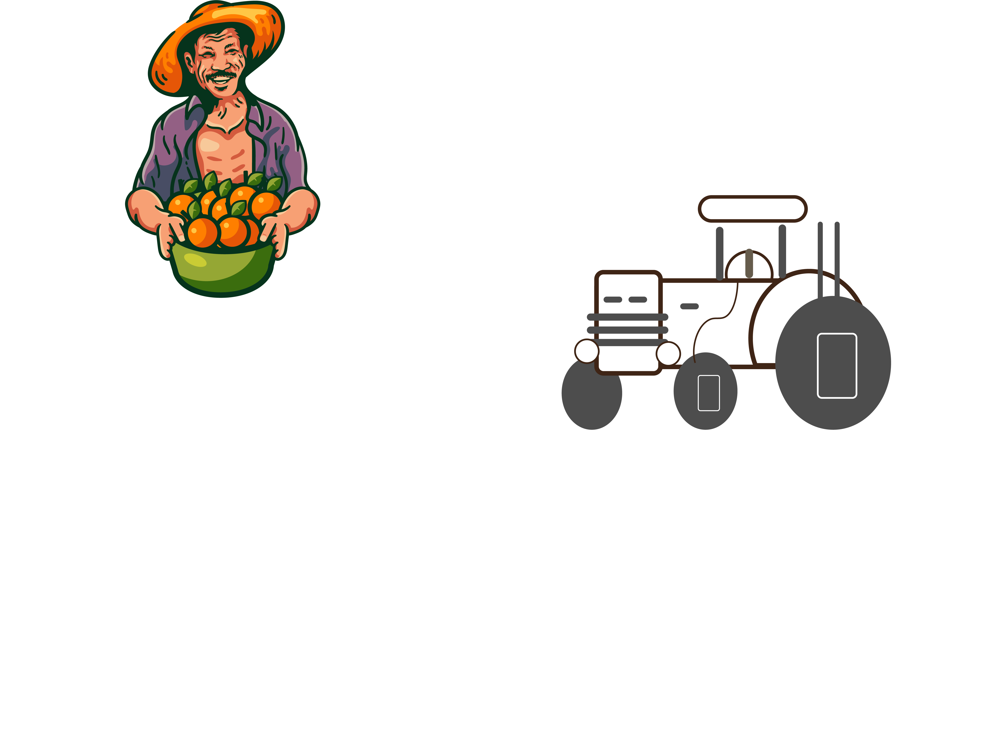

# Smart Chashi (স্মার্ট চাষী)

<div align="center">



**AI-Powered Agricultural Management Platform for Bangladesh Farmers**

[](#)
[](LICENSE)
[](https://php.net)
[](https://mariadb.org)
[](#)

</div>

---

## Overview

Smart Chashi is a full-stack agricultural platform built on PHP + MySQL (XAMPP), serving Bangladeshi farmers with AI-powered crop advisory, disease detection, marketplace, weather integration, and a ChatGPT-style AI assistant called **Chashi Bhai**.

**Languages supported:** Bengali (বাংলা) and English  
**Target users:** Farmers, agricultural officers, platform admins

---

## Documentation

| Document | Description |
|----------|-------------|
| [Setup Guide](docs/setup.md) | Installation, database, configuration |
| [Architecture](docs/architecture.md) | System design, directory structure, request flow |
| [AI Agent — Chashi Bhai](docs/agent.md) | Chat interface, memory system, features |
| [AI Providers](docs/ai-providers.md) | GROQ, Gemini, Claude, OpenAI, DeepSeek setup |
| [Admin Panel](docs/admin.md) | Admin features, reports, analytics, settings |
| [API Reference](docs/api.md) | AJAX endpoints, request/response formats |
| [Database Schema](docs/database.md) | Tables, relationships, migrations |
| [Shop Module](docs/shop.md) | E-commerce, orders, cart, reviews |
| [Disease Detection](docs/disease-detection.md) | ML pipeline, 4-tier detection, Python setup, API |

---

## Quick Start

### Requirements

- XAMPP (Apache + MariaDB 10.4+ + PHP 8.0+)
- PHP extensions: `pdo_mysql`, `curl`, `mbstring`, `gd`
- MariaDB 10.4+ (bundled with XAMPP) or MySQL 8.0+

### Install

```bash
# 1. Clone into htdocs
cd C:/xampp/htdocs
git clone <repo> smartchashi

# 2. Start Apache + MySQL in XAMPP

# 3. Import database (single file — 80+ tables with seed data)
# Open phpMyAdmin → create database `smartcashi_db` (collation: utf8mb4_unicode_ci)
# Import: Database/smartcashi_db.sql

# 5. Configure API keys
# Edit config/config.php — see docs/setup.md
```

### Access

| URL | Description |
|-----|-------------|
| `http://localhost/smartchashi/` | Main platform |
| `http://localhost/smartchashi/agent/chat` | AI Chat (Chashi Bhai) |
| `http://localhost/smartchashi/admin-secure/` | Admin panel |
| `http://localhost/smartchashi/shop/` | Marketplace |
| `http://localhost/smartchashi/disease` | Disease detection (PHP, integrated) |

**Standalone Python ML Service** (optional — higher accuracy Tier 1):

```
Disease detection\run.bat     ← double-click to auto-install and start
```

| Service | URL | Description |
|---------|-----|-------------|
| ML API | `http://localhost:5000` | ViT plant detection REST API |
| Web UI | `http://localhost:8080` | Standalone disease detection web app |

---

## Features

### For Farmers
- **AI Advisory** — Chashi Bhai answers crop, pest, soil, weather, and market questions in Bengali and English
- **Disease Detection** — Upload crop photos for AI-powered disease identification via a 4-tier pipeline: Python EfficientNet-B0 ML model → Gemini Vision → PHP GD color analysis → mock fallback
- **Weather** — Real-time forecasts via Open-Meteo (free, no API key needed)
- **Marketplace** — Buy/sell agricultural products
- **Community** — Post questions, share experiences, get peer advice
- **Learning Hub** — Agricultural tutorials and guides
- **Scheduling** — Plan farm tasks and get reminders
- **Reports** — Track crop performance and generate reports

### For Agricultural Officers
- Separate officer dashboard
- Review farmer reports and alerts
- Post advisories and alerts
- Manage learning content

### For Admins
- Full user management
- AI provider configuration (switch between GROQ, Gemini, Claude, OpenAI, DeepSeek)
- Analytics: users, marketplace, content, AI usage
- Report generation (CSV/JSON) with scheduling
- Security monitoring and audit logs
- Notification management
- System health monitoring

### AI Agent (Chashi Bhai)
- ChatGPT-style multi-conversation UI
- Cross-conversation user memory (auto-extracts facts from chat)
- 11-layer intelligence stack (RAG + BRRI/BARI data + LLaMA 3.3 70B)
- Voice input (Web Speech API) and TTS output
- Image attachment with lightbox
- In-conversation message search (Ctrl+F)
- Follow-up question suggestions
- Conversation export (TXT / Markdown / JSON)
- Message feedback (thumbs up/down)
- 5 personality modes (General, Pest Expert, Soil Scientist, Market Advisor, Weather)
- Bengali and English language toggle

---

## Tech Stack

| Layer | Technology |
|-------|-----------|
| Backend | PHP 8.0+ (no framework) |
| Database | MariaDB 10.4+ via custom PDO wrapper |
| Primary AI | GROQ — LLaMA 3.3 70B (free tier) |
| Fast AI | GROQ — llama-3.1-8b-instant |
| Disease AI (Tier 1) | Python FastAPI + EfficientNet-B0 (PyTorch, 38 classes) |
| Disease AI (Tier 2) | Google Gemini Vision API (gemini-1.5-flash) |
| Weather | Open-Meteo (free, no key) |
| Frontend | Vanilla JS + Material Icons |
| Server | Apache via XAMPP |

---

## Project Structure

```
smartchashi/
├── config/          # Database + app constants, session setup
├── layouts/         # Shared HTML header/footer (main site)
├── pages/           # User-facing pages (30+)
├── ajax/            # AJAX handlers for main site
├── api/             # REST API endpoints (auth, disease, crops, community)
├── providers/       # AI provider classes (GROQ, Gemini, Claude, OpenAI, etc.)
├── agent/           # Chashi Bhai AI chat module
│   ├── api/         # conversations.php, send.php
│   └── assets/      # CSS, JS, logo
├── admin-secure/    # Admin panel
│   ├── pages/       # Admin page files
│   ├── ajax/        # Admin AJAX handlers
│   └── layouts/     # Admin header/sidebar
├── shop/            # E-commerce module
│   ├── pages/       # Shop pages
│   ├── ajax/        # Cart, orders, reviews AJAX
│   └── assets/      # Shop CSS/JS
├── Database/        # Main DB schema SQL
├── public/          # Public CSS, JS, uploads
├── img/             # App logo and images
└── uploads/         # User uploads (disease photos, etc.)
```

---

## License

MIT — see [LICENSE](LICENSE)

---

*Courtesy: **mohatamim** — [facebook.com/mohatamim44](https://www.facebook.com/mohatamim44)*
